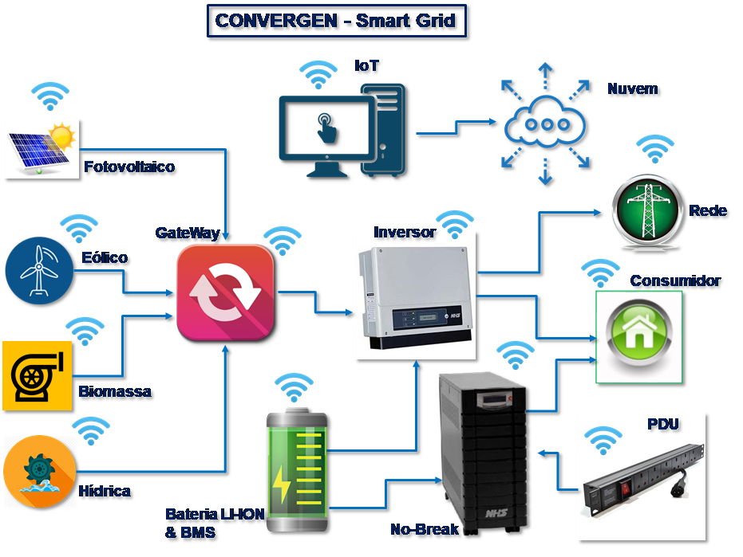
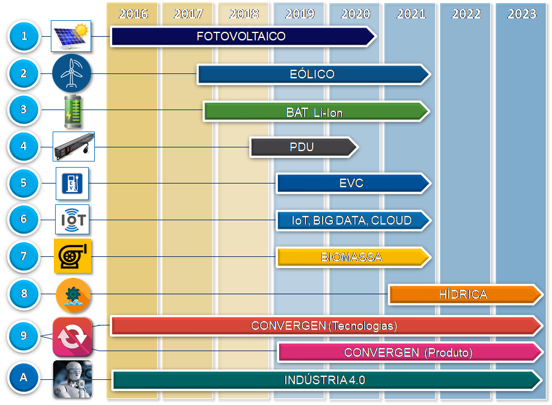

# Pesquisa e desenvovimento em convergência de soluções de sistema Smart Grid, de geração, integração e controle de energias renováveis para a empresa NHS

## OBjetivo
O projeto tem por objetivo, aplicar os conhecimentos adquiridos com as investigações e os desenvolvimentos pertinentes aos termos de cooperação anteriores firmados entre a NHS
e o IBTI, preenchendo assim as lacunas de conhecimento tecnológico, obter a compreensão na integração e convergência de soluções em sistemas de energias renováveis
com o conceito da Indústria 4.0 em seus fundamentos em especial, Smart Grids, IoT, Big Data / Analytics, dentre outros. 
O projeto envolve a integração destas tecnologias, transferência de tecnologia de projetos e soluções integradas, associando-as ao nível de maturidade I4.0 da NHS, 
criando assim, um Roadmap tecnológico alinhado com a estratégia e o núcleo de negócios da empresa. 
Todo o desenvolvimento experimental ocorrerá de maneira sistemática, implantando novos processos, sistemas e serviços, bem como, melhorando aqueles já produzidos e 
implantados anteriormente, tudo em conjunto com a equipe técnica da NHS, de forma a transferir a tecnologia do projeto durante a sua execução, garantindo assim, 
uma definição detalhada das funcionalidades e o cumprimento das metas definidas necessárias.

Entre as hipóteses identificadas pelo IBTI, as tecnologias para o desenvolvimento experimental proposto pelo projeto e objeto de estudo técnico conforme os seguintes temas:
- Sistemas de energia renováveis – Integração de sistemas híbridos considerando o melhor aproveitamento na disponibilidade das fontes naturais de energia Fotovoltaica, 
Eólica, Hídrica e Biomassa, bem como, as possibilidades de armazenamento destas energias para uma posterior utilização racional e integração aos inversores híbridos de 
tecnologia própria da NHS.
- Energia Eólica – Turbinas Horizontais e Verticais, sistema de Monitoramento Meteorológico, carregador MPPT (Maximum Point Power Tracking) para sistema de Turbinas Eólicas 
600W, 1,0kW e 2Kw, incluindo testes e provas de conceito, testes funcionais, e compatibilização com inversores híbridos fotovoltaicos de tecnologia própria da NHS.
- Turbinas a gás e geradores elétricos – considerando os sistemas de armazenamento de material orgânico, geração de gás natural, sistema de pressurização e queima, 
conversão de energia mecânica em elétrica por meio de turbo gerador, sistema de controle e retificação CA/CC, e compatibilização com inversores híbridos fotovoltaicos 
de tecnologia própria da NHS.
- Estudo de Baterias com tecnologia de Litio-Ion e sistema de monitoramento BMS (Battery Management System) e integração aos inversores híbridos fotovoltaicos de tecnologia 
própria da NHS.
- Estudo do estado da arte de sistemas de compatibilização entre diferentes fontes de energia, aqui denominado “gateway”, para integração de sistemas às redes 
inteligentes Smart Grids.
O estudo tecnológico compreenderá a Pesquisa Básica de Tecnologias, estudo do estado da arte e da técnica atual, a pesquisa de novos materiais, a identificação de barreiras
e lacunas tecnológicas, a identificação dos defeitos e dificuldades, as possibilidades de melhorias, o levantamento de requisitos técnicos e de mercado, o levantamento de
fabricantes, produtos, países e mercados, o levantamento dos Custos & Preços & Produção, a participação em feiras e congressos nacionais e internacionais, a definição de 
Escopo Técnico, o estudo de viabilidade técnica, o desenvolvimento do projeto e de novas aplicações e soluções; a definição de ensaios de desempenho e a avaliação e
validação final do Projeto.
A criação de provas de conceito funcionais também é prevista, pois terá como resultado prático a consolidação das tecnologias previstas no Roadmap Tecnológico 
apresentado pela NHS.

O projeto CONVERGEN é representado na figura 1, onde os principais elementos são:
- Fonte de energia Fotovoltaica.
- Fonte de energia Eólica.
- Fonte de energia Biomassa.
- Fonte de energia Hídrica.
- Baterias de Litio Ion com BMS (sistema de gerenciamento).
- Gateway – conversor integrador de fontes renováveis.
- Inversor Híbrido.
- No-Break.
- Unidade de distribuição de energia (PDU).
- Sistema de coleta de dados e controle (IoT – LORA) em nuvem. 

O IBTI e a NHS já desenvolveram projetos anteriores de acordo com os termos de cooperação tecnológica firmados abaixo descritos, e o presente projeto também alinhará 
todos estes projetos, tanto os já desenvolvidos, bem como os que ainda estão em desenvolvimento, relativos aos sistemas de energia renováveis fotovoltaica, 
com os sistemas eólicos.

Estes projetos já iniciados anteriormente são importantes para a correta compreensão do atual projeto em pauta, e, portanto, são resumidos como se segue. 

### TA-01 /2016 e TA-02 / 2016 – “Roadmap NHS SmartGrids – Fases 1 e 2”

Projeto que realizou um estudo para compreender as tecnologias no setor de redes de energia inteligentes, denominadas SmartGrids, e estabeleceu um “Roadmap” 
Tecnológico para a NHS preencher uma lacuna de conhecimento desta tecnologia, e pode avançar no desenvolvimento de projeto específico de energia fotovoltaica 
integrada às redes inteligentes, e que resultou em uma melhor compreensão das topologias de inversores fotovoltaicos, suas configurações e aplicações, permitindo assim, 
alinhar os projetos da NHS com as tendências mundiais no setor elétrico das redes inteligentes de energia, melhor aproveitamento destas fontes renováveis, identificando 
também novas oportunidades para desenvolvimento de futuros projetos inovadores como microinversores solares inteligentes e autônomos, No-Breaks domésticos integrados aos 
sistemas fotovoltaicos, aplicativos para aquisição de dados em sistemas integrados de energia fotovoltaica, que mesmo  sendo inviáveis para a NHS no momento daquele contexto, 
são ainda oportunidades de avanço tecnológico que podem ser exploradas e podem ser disruptivas com a evolução dos projetos da empresa, pois a matriz energética brasileira cada 
vez mais requer soluções alternativas para o crescimento sustentável.

### TA-03 / 2017 – “NHS Solar”
Projeto que utilizou dos conhecimentos adquiridos nos dois projetos anteriores, aprofundou o entendimento dos sistemas fotovoltaicos, suas soluções e aplicações, 
integrando os inversores solares, com os painéis de coleta e geração de energia, identificando as arquiteturas de montagem e integração destes componentes com os 
sistemas de proteção e distribuição, com a rede elétrica da concessionária e com as instalações da unidade consumidora da energia propriamente dita.

Com isso, o projeto original evoluiu para o dimensionamento da quantidade e topologia de painéis fotovoltaicos; desenvolvimento de soluções mecânicas escaláveis completas 
com estruturas de montagem em diversas configurações, a saber, telhados cerâmicos, fibro-cimento, metálico e pisos; o que originou um conjunto de peças e materiais 
específicos e únicos, desenvolvidos em conjunto entre as equipes da NHS e IBTI, para aplicação nas soluções da NHS em sistemas fotovoltaicos, elevando a NHS da 
categoria de um fornecedor de equipamentos singelos, para um provedor de soluções integradas de energia elétrica da rede da concessionária com os 
sistemas de energia renovável fotovoltaica. 

### TA-04 / 2017 – “NHS Solar”
Projeto que utilizou dos conhecimentos adquiridos nos três projetos anteriores, aprofundou o entendimento dos sistemas fotovoltaicos e eólico integrados, 
a vantagem de sua combinação em um só sistema, integrando os inversores solares, com os painéis e turbinas eólicas, bem como, com o sistema de armazenamento de 
energia de baterias Litio-Ion, aplicando e reforçando a capacitação da equipe técnica da NHS para todos estes conceitos integrados, mediante capacitação e desenvolvimento 
de ferramentas para o dimensionamento destes sistemas de energia híbrido.

### TA-05 / 2018 – “INDÚSTRIA 4.0”
Projeto que apresentou os conceitos e as tecnologias pilares da Indústria 4.0, com especial foco na IoT – Internet das Coisas (Internet of Things), 
Redes Inteligentes (Smart Grids), aquisição e análise de grande volume de dados (Big Data / Analytics), que foram associados aos outros quatro projetos anteriores, 
para visualizar a possibilidade de integração e convergência destes projetos e tecnologias, para o aprimoramento dos processos produtivos da NHS, e também, da ampliação 
das funcionalidades dos produtos de seu portfólio. 

Esta possibilidade gerou a oportunidade de um importante avanço tecnológico para a NHS, que pode planejar um projeto abrangente e de grande envergadura no que 
concerne à Indústria 4.0, às redes inteligentes, às fontes renováveis, eficiência energética e sustentabilidade.

## Cronograma

